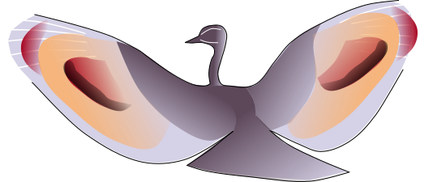

# Sunbittern Repository

**Updated geographical distribution of the Sunbittern (Eurypyga helias: Eurypigidae)**
_Leon-Alvarado OM, Mendez-Camacho KA, Arenas-Gonzáles F, Medina-Contreras D_
Caldasia 44(3): 612--618

Directories:

  + __Data:__ CSV files used.
  + __R:__ The R-scripts for the MaxEnt model.
  + __shp:__ The shp file with the current distribution, but also with the extensions proposed.
  + __Map:__ The interactive map in HTML format, downloable. 

 
Click <a href="https://rpubs.com/oleon12/618773">here</a> for the interactive map
 

[rpubs]:https://rpubs.com/oleon12/618773
